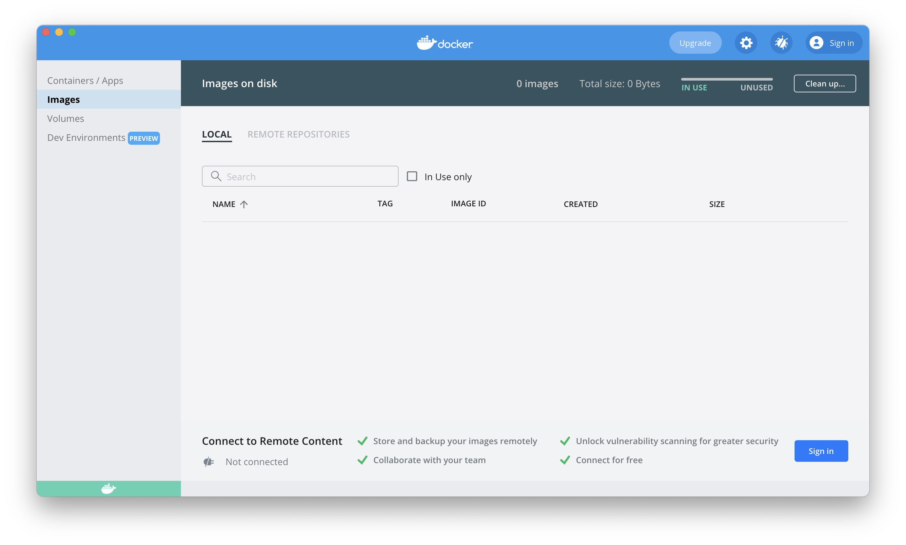
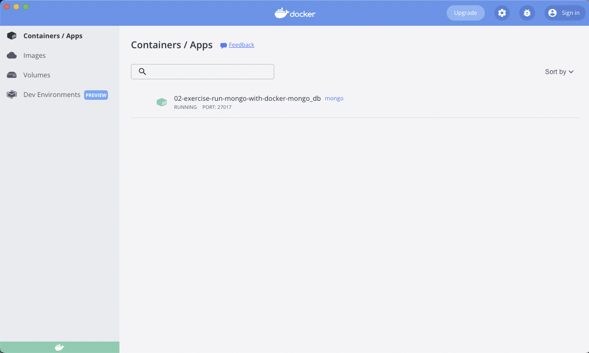
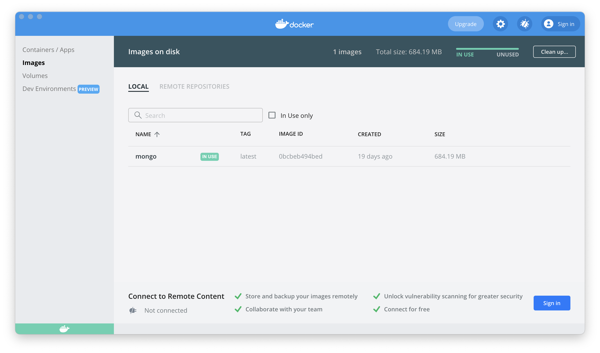
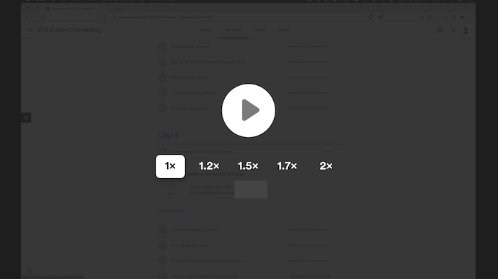

[](https://classroom.github.com/online_ide?assignment_repo_id=7821963&assignment_repo_type=AssignmentRepo)
# 02 Exercise - Run MongoDB with Docker 

## Brief

You are going to introduce a MongoDB database into your Application. The first step is to install the required applications and test that you can run, connect and query a MongoDB database.

## Instructions Part A - Running MongoDB in Docker

Firstly, always remember to run `npm install`. This will enable tools like Prettier and ESLint.

Docker is an industry-standard tool that allows you to package applications into containers. Docker allows developers to build, run and stop these containers efficiently. You will be using Docker to run MongoDB on your computer (aka your local development environment).

Start by downloading and installing [Docker Desktop](https://www.docker.com/get-started). Docker Desktop is an application to manage aspects of Docker.

When Docker has started, Docker Desktop will look like the following:


Open the Images tab. You will not have any images yet.



Once Docker Desktop is installed and running, you can instruct Docker to download a MongoDB image and start it in your local development environment. 

Open the Terminal in VS Code, and type 

```shell
docker run --name 02-exercise-run-mongo-with-docker-mongo_db \
  -p 27017:27017 \
  -v 02-exercise-run-mongo-with-docker-mongodb_data_container:/data/db \
  -d \
  mongo
```

<details>
<summary>Understanding the syntax</summary>

`\` - This is the terminal syntax to ignore the new line and carry on reading commands from the next line.

`--name` - A friendly name so we can reference the container later by name instead of an ID or randomly generated name.

`-p 27017:27017` - this is the traditional port on which Mongo runs. We are allowing this port on our local machine to access 27017 on the container.

`-v 02-exercise-run-mongo-with-docker-mongodb_data_container:/data/db` - This creates a persistent volume named `2-exercise-run-mongo-with-docker-mongodb_data_container` and mounts the volume inside the container filesystem at `/data/db`. If you ever delete the container it is easy to spin up a new container without losing your data as the persistent volume can be re-used between containers.

`-d` - Run the container in detached mode (or in the background) as we don't need access to the terminal inside the container.

`mongo` - The name of the container image to run. Note, there is no image tag specified, so Docker will use the latest image.

</details>


Your command line will start indicating Docker is downloading the MongoDB image from [Docker Hub](https://hub.docker.com/). Once it's downloaded, it will start MongoDB.

Open Docker Desktop again, and notice the container and images tabs now contain information. This is because running `docker run` instructed Docker to download MongoDB from Docker Hub and use the image to start a container for this exercise.





#### Other useful docker commands

`docker start <<container name>>` - This will start the a container you have already created. i.e. `docker start 02-exercise-run-mongo-with-docker-mongo_db`

`docker stop <<container name>>` - This will stop the container you have specified. i.e. `docker stop 02-exercise-run-mongo-with-docker-mongo_db`


</details>

### Instructions Part B - Load data into MongoDB using MongoDB Compass

Now you have MongoDB running in Docker, you can connect and add data to it.

MongoDB provides a desktop application named Compass, where you can connect to MongoDB databases. Install [MongoDB Compass](https://docs.mongodb.com/compass/current/install/), and open it.

<a href="https://www.loom.com/share/a9960ff990394748b6923207fe80e6d9">
  
   <p>Load data into MongoDB using MongoDB Compass (2mins)</p>
</a>

## Instructions Part C - Query data in MongoDB

Complete the [Query Documents](https://docs.mongodb.com/manual/tutorial/query-documents/) tutorial from the MongoDB documentation.

--- 

# Submit your Exercise

- [ ] Commits are pushed to GitHub
- [ ] Exercise has been submitted in Google Classroom
